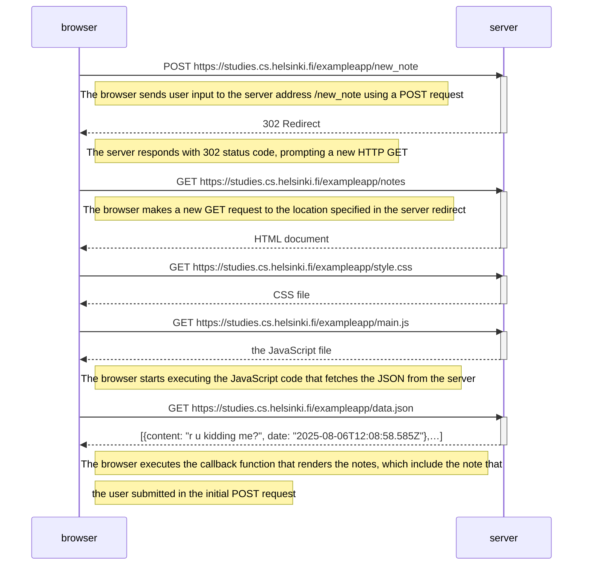

```mermaid
  sequenceDiagram;
    participant browser
    participant server

    browser->>server: POST https://studies.cs.helsinki.fi/exampleapp/new_note
    activate server

    Note right of browser: The browser sends user input to the server address /new_note using a POST request

    server-->>browser: 302 Redirect
    deactivate server

    Note right of browser: The server responds with 302 status code, prompting a new HTTP GET

    browser->>server: GET https://studies.cs.helsinki.fi/exampleapp/notes
     activate server

    Note right of browser: The browser makes a new GET request to the location specified in the server redirect

    server-->>browser: HTML document
    deactivate server

    browser->>server: GET https://studies.cs.helsinki.fi/exampleapp/style.css
    activate server
    server-->>browser: CSS file
    deactivate server

    browser->>server: GET https://studies.cs.helsinki.fi/exampleapp/main.js
    activate server
    server-->>browser: the JavaScript file
    deactivate server

    Note right of browser: The browser starts executing the JavaScript code that fetches the JSON from the server

    browser->>server: GET https://studies.cs.helsinki.fi/exampleapp/data.json
    activate server
    server-->>browser: [{content: "r u kidding me?", date: "2025-08-06T12:08:58.585Z"},…]
    deactivate server

    Note right of browser: The browser executes the callback function that renders the notes, which include the note that
    Note right of browser: the user submitted in the initial POST request
```
   
