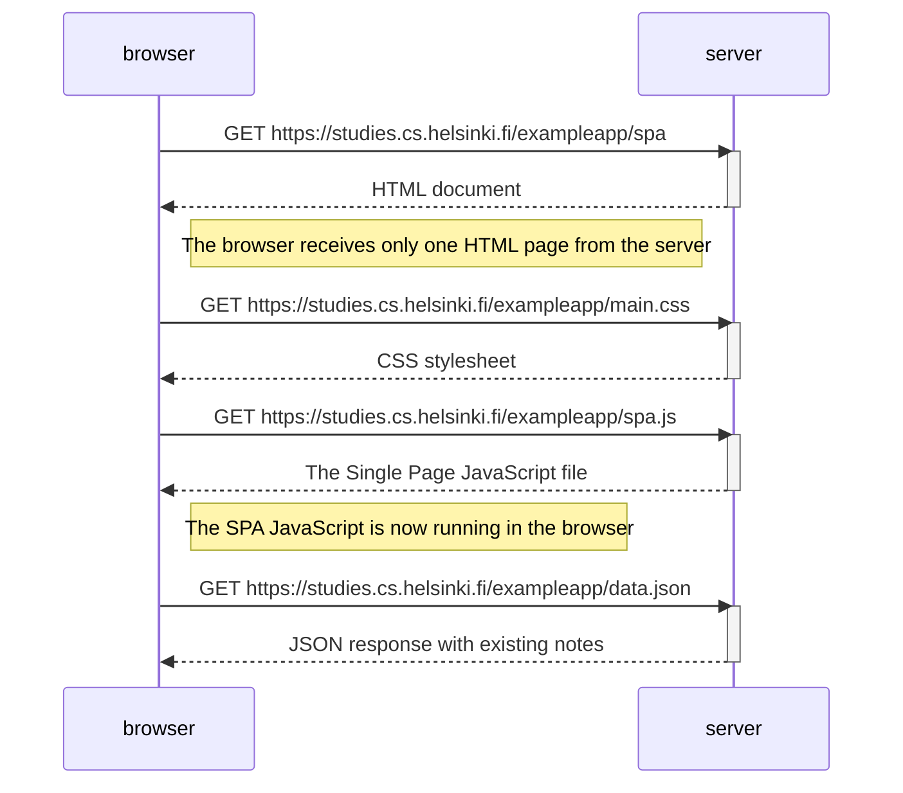

```mermaid
  sequenceDiagram;
    participant browser
    participant server
  
    browser->>server: GET https://studies.cs.helsinki.fi/exampleapp/spa
    activate server
    server-->>browser: HTML document
    deactivate server
  
    Note right of browser: The browser receives only one HTML page from the server

    browser->>server: GET https://studies.cs.helsinki.fi/exampleapp/main.css
    activate server
    server-->>browser: CSS stylesheet
    deactivate server
  
    browser->>server: GET https://studies.cs.helsinki.fi/exampleapp/spa.js
    activate server
    server-->>browser: The Single Page JavaScript file
    deactivate server
  
    Note right of browser: The SPA JavaScript is now running in the browser
  
    browser->>server: GET https://studies.cs.helsinki.fi/exampleapp/data.json
    activate server
    server-->>browser: JSON response with existing notes
    deactivate server
```
