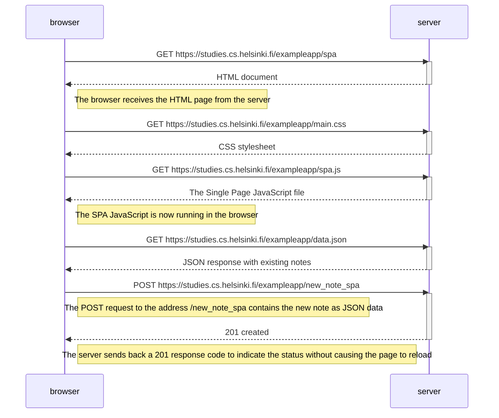

```mermaid
  sequenceDiagram;
    participant browser
    participant server
  
    browser->>server: GET https://studies.cs.helsinki.fi/exampleapp/spa
    activate server
    server-->>browser: HTML document
    deactivate server
  
    Note right of browser: The browser receives the HTML page from the server

    browser->>server: GET https://studies.cs.helsinki.fi/exampleapp/main.css
    activate server
    server-->>browser: CSS stylesheet
    deactivate server
  
    browser->>server: GET https://studies.cs.helsinki.fi/exampleapp/spa.js
    activate server
    server-->>browser: The Single Page JavaScript file
    deactivate server
  
    Note right of browser: The SPA JavaScript is now running in the browser
  
    browser->>server: GET https://studies.cs.helsinki.fi/exampleapp/data.json
    activate server
    server-->>browser: JSON response with existing notes
    deactivate server

    browser->>server: POST https://studies.cs.helsinki.fi/exampleapp/new_note_spa
    activate server

    Note right of browser: The POST request to the address /new_note_spa contains the new note as JSON data

    server-->>browser: 201 created
    deactivate server

    Note right of browser: The server sends back a 201 response code to indicate the status without causing the page to reload 
```
